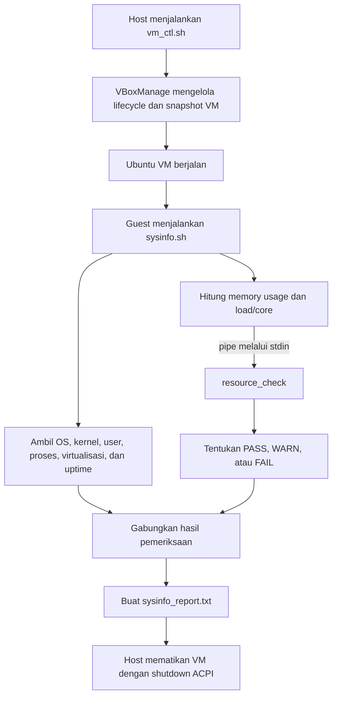

# VM Manager - Kelompok B3

VM Manager adalah program sederhana untuk mengendalikan Virtual Machine (VM) VirtualBox dari sisi host dan memantau kondisi sistem Ubuntu dari sisi guest. Proyek ini dibuat untuk Tugas 1 mata kuliah Sistem Operasi, Varian B.

## Pembagian Tugas

| Anggota | NPM | Tugas utama |
|---|---:|---|
| Faris Salman Azhari | 2506615223 | Mengintegrasikan seluruh komponen, membuat `sysinfo_report.txt`, menambahkan fitur uptime VM, dan menyusun laporan tugas. |
| Syabil Wafi Ahdi | 2506657371 | Mengembangkan lifecycle VM pada `vm_ctl.sh`: melihat daftar dan informasi VM, serta menyalakan dan mematikan VM dengan aman. |
| Dyah Zhafira Wibowo | 2506623723 | Mengembangkan fitur snapshot pada host serta pemeriksaan informasi sistem dasar pada guest. |
| Silvia Lalita Damayanti | 2506621863 | Mengembangkan metrik resource Varian B, `resource_check.c`, dan komunikasi data melalui pipe/standard input. |

## Struktur Program

| Berkas | Lingkungan | Fungsi |
|---|---|---|
| `vm_ctl.sh` | Host | Mengendalikan VM melalui `VBoxManage`: `list`, `info`, `start`, `stop`, `snapshot create`, dan `snapshot list`. |
| `sysinfo.sh` | Guest | Mengambil informasi sistem, menghitung metrik, menjalankan pemeriksaan resource, menampilkan uptime, dan membuat laporan. |
| `resource_check.c` | Guest | Membaca nilai memory usage dan load/core dari standard input, lalu menentukan status `PASS`, `WARN`, atau `FAIL`. |
| `sysinfo_report.txt` | Guest | Menyimpan hasil akhir pemeriksaan dalam bentuk tabel teks. |
| [`LaporanTugas1_B3.pdf`](./LaporanTugas1_B3.pdf) | Dokumentasi | Menjelaskan pembagian tugas, desain, implementasi, pengujian, dan kesimpulan proyek. |

## Workflow Kode



Alur program secara singkat:

1. Pada host, `vm_ctl.sh` meneruskan perintah pengguna ke `VBoxManage`. VM dapat didaftarkan, diperiksa, dinyalakan secara headless, dibuatkan snapshot, dan dimatikan secara aman dengan sinyal ACPI.
2. Di dalam guest Ubuntu, `sysinfo.sh` membaca informasi OS/kernel, akun pengguna biasa, jumlah proses, status virtualisasi, dan uptime.
3. Script menghitung dua metrik Varian B:
   - **Memory usage** = `(total memory - available memory) / total memory x 100%`.
   - **Load/core** = `load average 1 menit / jumlah CPU core`.
4. Kedua nilai dikirim oleh Bash ke binary `resource_check` melalui pipe dan standard input:

   ```bash
   result=$(echo "$memory_usage $load_ratio" | ./resource_check)
   ```

5. Program C mengklasifikasikan nilai tersebut berdasarkan threshold berikut.

   | Metrik | PASS | WARN | FAIL |
   |---|---:|---:|---:|
   | Memory usage | `< 75%` | `>= 75%` dan `< 90%` | `>= 90%` |
   | Load/core | `<= 1` | `> 1` dan `<= 2` | `> 2` |

6. `sysinfo.sh` menggabungkan status dari program C dengan informasi sistem lainnya, kemudian menyimpan hasilnya ke `sysinfo_report.txt`.

## Cara Menjalankan

### Sisi host

Jalankan melalui Bash pada komputer yang telah memasang VirtualBox dan menyediakan perintah `VBoxManage`.

```bash
./vm_ctl.sh list
./vm_ctl.sh info "VM-Manager"
./vm_ctl.sh start "VM-Manager"
./vm_ctl.sh snapshot create "VM-Manager" "demo-snapshot"
./vm_ctl.sh snapshot list "VM-Manager"
```

### Sisi guest

Kompilasi program C terlebih dahulu, lalu jalankan pemeriksaan sistem.

```bash
chmod +x sysinfo.sh
gcc resource_check.c -o resource_check
printf "80 1.5\n" | ./resource_check
./sysinfo.sh
cat sysinfo_report.txt
```

Setelah pemeriksaan guest selesai, VM dapat dimatikan dari host:

```bash
./vm_ctl.sh stop "VM-Manager"
```

## Ringkasan Laporan PDF

`LaporanTugas1_B3.pdf` menjelaskan pembuatan VM Manager sebagai integrasi antara pengelolaan VM dari host dan monitoring resource dari guest. Bagian host menggunakan `vm_ctl.sh` dan `VBoxManage` untuk lifecycle VM serta snapshot. Bagian guest menggunakan `sysinfo.sh` untuk mengambil informasi sistem dan menghitung memory usage serta load/core sesuai ketentuan Varian B.

Laporan juga membahas penggunaan pipe dan standard input untuk mengirim kedua metrik ke `resource_check.c`. Program C menentukan status `PASS`, `WARN`, atau `FAIL`, lalu hasilnya diambil kembali oleh Bash dan dimasukkan bersama informasi OS, pengguna, proses, virtualisasi, dan uptime ke `sysinfo_report.txt`.

Pengujian dilakukan secara end-to-end: VM dinyalakan dari host, fungsi snapshot diuji, program C dikompilasi dan diuji dengan input contoh, pemeriksaan guest dijalankan, laporan teks diperiksa, lalu VM dimatikan dengan mekanisme shutdown yang aman. Kesimpulan laporan menyatakan bahwa seluruh komponen telah terintegrasi menjadi satu alur kontrol dan monitoring VM. Bagian tautan video presentasi di PDF masih berisi placeholder `LINK VIDEO UNLISTED YOUTUBE`.
